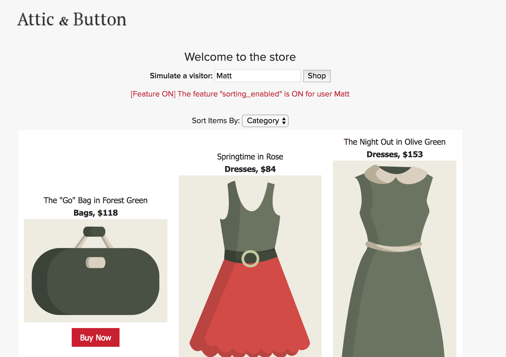
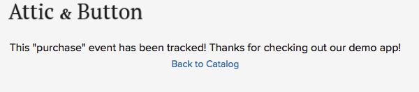

# Optimizely Javascript SDK Tutorial

This tutorial enables you to quickly get started in your development efforts to create a Javascript-based webpage with the Optimizely X Javascript SDK Demo. This demo package includes an interactive project that illustrates how an online retailer could develop a new feature behind a toggle, roll it out gradually to more users, and run an experiment that tracks a business metric for the new and the old experiences.

The feature is a dropdown allowing the user to sort items by price or category, giving the user more control over just viewing products randomly on the page. To roll this feature out, it has been built behind an Optimizely-powered Feature Flag that provides the ability to gate access without the need to deployment different versions of code.



You can run the app locally and mimic the bucketing of website visitors by entering unique user IDs into the edit field. For example, entering the user ID **Matt** simulates a unique visitor, and the app uses the SDK to determine whether the sorting dropdown feature is displayed. The bucket assigned to a specific unique visitor, such as Matt, is deterministic. This means that so long as the Optimizely conditions remain the same, Matt will always have the same experience.

The demo works as follows:
* Configuration includes setting up a project, feature, and event in the Optimizely dashboard, which is accessed by the demo web page using the Optimizely Javascript API.
* The demo app consists of a single web page stored in **./src/index.html** and a local server listening on Port 8080. The SDK is included in the web page via a [webpack](https://webpack.js.org) bundle.
* The main function and UI event handlers for the web page are defined in **./src/js/index.js**.
* The code to create an Optimizely Client instance is defined in **/src/js/optimizely_manager.js**.
* As the web page is rendered, the list of products and the names of their associated images are read from **./src/items.csv**.
* When the user clicks **Shop**, the demo invokes `isFeatureEnabled`, passing the user ID (specified in the edit field) and the feature name (`sorting_enabled`), to determine if the sorting dropdown should be shown for the user.
* When the user clicks one of the **Buy Now** buttons, the demo invokes `track`, passing in the event key `item_purchase` and the user ID to track the event.

## Prerequisites
* [Optimizely account](https://app.optimizely.com/signin)
* [npm](https://www.npmjs.com/get-npm)

## Quick start
This section shows you how to prepare the project in the Optimizely portal and then run the demo in a browser hosted by a local server.

### Preparing an Optimizely Project
This section provides the steps to prepare an Optimizely project in your dashboard.

1. Clone or download the **javascript-sdk-demo-app** package.
2. Log in or create an [Optimizely Account](https://app.optimizely.com/signin).
3. Create a project via the Optimizely dashboard.
4. Add a Feature with the key `sorting_enabled`. This will act as a toggle for the sorting Feature.
5. Add a Variable Key to the Feature called `welcome_message`, set a default value, and save the Feature.
6. Add an Event Key called `item_purchase` and save the event. This event will be triggered when one of the **Buy** buttons is clicked.
7. Create a new Experiment using the Feature `sorting_enabled`. Create two variations with a 50/50 split where only one variation is enabled for the sorting Feature.
8. Navigate to the directory where the package was downloaded to in Step 1 and open **./constants.js** in a text editor.
9. Update the default `datafileURL` field in the file with the URL from your Optimizely dashboard, located under **Settings** > **Environments**. The URL points to the JSON data file stored on Optimizely that will be used by code within the demo.
```javascript
// constants.js

// Default datafile provided to get up and running quickly. Replace with your own!
//const datafileURL = 'https://cdn.optimizely.com/datafiles/CpqC7ch493FEqa3HzY3963.json';
const datafileURL = 'https://cdn.optimizely.com/datafiles/626QeFJNZRdW8SkvGSFEuq.json'; <- replace this with your URL

module.exports = {
  datafileURL
}
```
8. Save the file. 

### Running the Server and Demo

1. Open a terminal window and navigate to the root of the **javascript-sdk-demo-app** package.
2. Install the dependencies:
```shell
npm install
```
3. Run the server:
```shell
npm start
```
Once the server is executing, the output should indicate that it's running on Port 8080.
4. Open a browser and enter `http://localhost:8080` as the URL. The demo webpage should display.

## How the Test App was Created
The following subsections provide information about key aspects of the demo and how it was put together:
* [Project Structure](#project-structure)
* [SDK Packaging](#sdk-packaging)
* [User Interface](#user-interface)
* [Visual Assets](#user-interface-and-visual-assets)
* [Styling](#styling)

### Package Structure
The following are the main components of interest in the package:

1. **constants.js**: contains the URL of the datafile to use for the experiment. The datafile acts as a config file and represents the state of your Optimizely project. It contains information like the status of your features, experiments, configuration parameters, and traffic allocation.
2. **webpack.config.js**: contains configuration information describing how the SDK is [bundled](#sdk-packacking) with the demo. 
3. **server.js**: contains the node.js server to run the demo locally on Port 8080.
4. **./node_modules**: contains the node.js dependencies.
5. **./src**: contains the HTML, Javascript, and resources for the (client-side) demo webpage. **index.html** contains the base web page UI that is displayed. **purchase.html** contains a message indicating that an event is being tracked by Optimizely.

### SDK Packaging
Instead of including the [Optimizely Javascript SDK](https://github.com/optimizely/javascript-sdk) on the page as a standalone JavaScript asset, the SDK was bundled with the web site's resources using [webpack](https://webpack.js.org). webpack bundles the source code, dependencies, application and experimentation logic, and the Optimizely SDK into a single bundle and is configured using the webpack configuration file: **./webpack.config.js**:
```javascript
const path = require('path');

const DIST_DIR = path.join(__dirname, '/dist');
const CLIENT_DIR = path.join(__dirname, '/src');

module.exports = {
  context: CLIENT_DIR,

  entry: './js/index',

  output: {
    path: DIST_DIR,
    filename: 'bundle.js',
  },
  resolve: {
    extensions: ['.js'],
  },
  target: 'web',
};

```

The bundled SDK is located in **./dist/bundle.js** and the demo source code is located in **./src**.

**Note:** alternatively you could use webpack to build two bundles: a standalone Optimizely SDK bundle that assigns a property to `window`, and your application bundle, which would make references to the global Optimizely SDK client variable.

### Visual Assets
**./src/items.csv** contains the list of products to sell on the demo website. For each product the file provides the description, color, name, price, and the name of a .png image file to display. The image files are located in **./src/images**:
|Asset                   |Description                                                                                        |
|------------------------|---------------------------------------------------------------------------------------------------|
|`item_1.png`            |Contains an image of a hat.|
|`item_2.png`            |Contains an image of a pair of shorts.|
|`item_3.png`            |Contains an image of a bag.|
|`item_4.png`            |Contains an image of a dress.|
|`item_5.png`            |Contains an image of a dress .|
|`item_6.png`            |Contains an image of a shirt.|
|`item_7.png`            |Contains an image of a shirt.|
|`item_8.png`            |Contains an image of a shirt.|
|`item_9.png`            |Contains an image of a sweater.|

### Styling
The web page (**index.html**) references a basic CSS located in **./src/css**.

### User Interface

**Main Page**
The base web page is defined in **./src/index.html** and the Javascript used by that page is defined in **./src/js/index.js**. When the web page starts, the `main` function in **index.js** is invoked and starts by creating an instance of Optimizely Client that will be used throughout the scripts:
```javascript

import OptimizelyManager from './optimizely_manager';

...

async function main() {
  const optimizelyClientInstance = await OptimizelyManager.createInstance();
  ...
}
```

**Note**: `OptimizelyManager` is a helper class and more information about it is provided below in [Create the Manager Instance](#create-the-manager-instance).

The function then sets up the `ready` handler:
```javascript
async function main() {
  const optimizelyClientInstance = await OptimizelyManager.createInstance();

  $(document).ready(function () {
    _buildItems()
      .then(_renderItemsTable)
      .then(function (tableHTML) {
        $('#items-table').html(tableHTML);
      });

    $('#input-name-button').on('click', function () {
      const userID = $('#input-name').val();
      if (!userID) {
        return;
      }
      shop(userID);
    });
  });

  ...
}
```

The `ready` handler starts by invoking a helper function called `_builditems` that reads the products from **./src/items.csv** and stores them in a collection. It then invokes a helper function called `_renderItemsTable` passing in the collection of products that that helper function uses to render into an HTML table. `_renderItemsTable` also sets up an onclick event handler for each **Buy** button. The `ready` handler finishes by adding an onclick event handler for the **Shop** button (the Shop button is described in more detail below).

**Note:** the helper functions are also located in **index.js**.

The `main` function also defines event handlers for the **Shop** and **Buy** buttons as described in the next section: [Functionality](#functionality).

**Tracking Page**
When the user clicks one of the **buy** buttons, the demo redirects the browser to **./src/purchase.html** to inform the user that the purchase event is being tracked by Optimizely. The purchase page includes a link called **Back to Catalog** that redirects the browser back to **index.html** when clicked:



## Configure Resources
To prepare for API usage:
* [Create the Manager Instance](#create-the-manager-instance)

### Create the Manager Instance
**./src/js/optimizely_manager.js** is a helper class that contains a method to create an instance of the Optimizely client:
```javascript
...
import {datafileURL} from '../../constants';

class OptimizelyManager {

  // instantiate the Optimizely client
  static async createInstance() {
    var datafile = await _getDatafile();
    return optimizely.createInstance({
      datafile: datafile,
      logger: logger.createLogger({
        logLevel: enums.LOG_LEVEL.DEBUG,
      }),
    });
  }
}
```

The function starts by invoking an asyncronous helper function called `_getDatafile()` (also defined in **optimizely_manager.js**) that gets the data from the file specified by the `datafileURL` const in **./constants.js**. This URL was configured above in [Preparing an Optimizely Project](#preparing-an-optimizely-project).

## Functionality
The demo illustrates how to:
* [Check if a Feature is Enabled](#check-if-a-feature-is-enabled)
* [Track the Experiment](#track-the-experiment)

### Check if a Feature is Enabled
When the user clicks the **Shop** button beside the input field, the `shop` event handler set up by `main` is invoked:
```javascript

function shop(userID) {
  // retrieve Feature Flag
  const isSortingEnabled = optimizelyClientInstance.isFeatureEnabled(
    'sorting_enabled',
    userID,
  );
  
  // display feature if enabled
  if (isSortingEnabled) {
    _renderSortingDropdown();
  } else {
  // ensure feature is disabled
    $('#sorting').remove();
  }

  // update UI to display if Feature Flag is enabled
  const indicatorBool = (isSortingEnabled) ? 'ON' : 'OFF';
  const indicatorMessage = `[Feature ${indicatorBool}] The feature "sorting_enabled" is ${indicatorBool} for user ${userID}`;
  $('#feature-indicator').html(indicatorMessage);

  // retrieve welcome message stored as a feature variable
  const welcomeMessage = optimizelyClientInstance.getFeatureVariableString(
    'sorting_enabled',
    'welcome_message',
    userID,
  );
  if (welcomeMessage) {
    $('#welcome').html(welcomeMessage);
  } else {
   // Set a default message
    $('#welcome').html('Welcome to Attic & Button');
  }
}
```

The handler takes in a user ID which is the name entered by the user in the edit field. The handler then invokes the `isFeatureEnabled` API passing the feature name `sorting_enabled` that was configured above in [Preparing an Optimizely Project](#preparing-an-optimizely-project) and the user ID. If the feature has been enabled for that user ID then the sort dropdown is displayed allowing the user to sort the products, otherwise a message is displayed informing the user that the feature has not been enabled. You can toggle the Feature Flag in the **Feature Flag** settings under **Rollouts** in your Optimizely dashboard.

**Note:** `isFeatureEnabled` also controls Rollouts and Feature Tests through the SDK's bucketing logic. This is helpful when rolling out the feature to larger audiences or running experiments. Read more about [SDK bucketing](https://help.optimizely.com/Build_Campaigns_and_Experiments/How_bucketing_works_in_Optimizely's_Full_Stack_SDKs) on the Optiverse.

The bottom of the event handler demonstrates the `getFeatureVariableString` API which is used to determine if a custom welcome message has been configured for the feature, and if it has, replaces the default message.

### Track the Experiment
When the user clicks one of the **Buy** buttons located below a product image, the `buy` event handler set up by `main` is invoked: 
```javascript
function buy() {
  const userID = $('#input-name').val();
  optimizelyClientInstance.track('item_purchase', userID);
  window.location.href = '/purchase.html';
}
```

The handler obtains the user ID entered by the user in the input field. The handler then invokes the `track` API passing in the `item_purchase` event that was configured above in [Preparing an Optimizely Project](#preparing-an-optimizely-project) and the user ID. Finally, the handler redirects the user to **.\src\purchase.html** to inform them about the experiment tracking.

## Additional Resources
* Developer Docs: https://developers.optimizely.com/x/solutions/sdks/
* Questions? Shoot us an email at developers@optimizely.com
